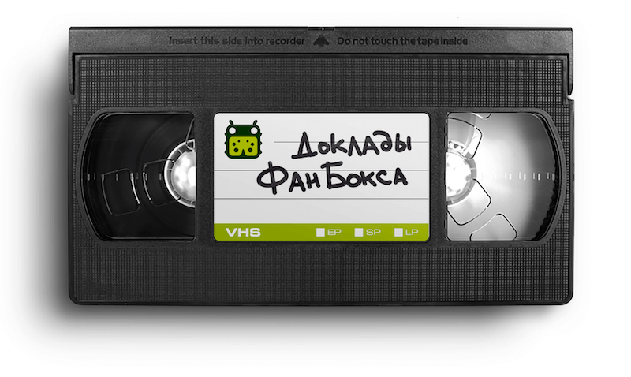

## 2020

### Innopolis Ruby Meetup, 1 октября

- **[Автоматизируем синхронизацию HTTP API и документации](/meetups/2020-10-01-innopolis-ruby/01-api-docs-sync/)**, Дмитрий Ефимов 
  Про конфликт документации по API и реализации, и способах его разрешения.

### Open DDD Meetup, 22 сентября

- **[Старт в новой предметной области на примере RCS](/meetups/2020-09-22-open-ddd/01-rcs/)**, Александр Лукашкин 
  Про практики и принципы DDD, которые использует команда RCS для старта разработки в новой предметной области.

### Митап фронтенда, 3 сентября

- **[Svelte. Лёгкий — не значит быстрый](/meetups/2020-09-03-frontend/01-svelte/)**, Евгений Пономарёв 
  Про сравнение производительности Svelte и React.

- **[Интересные решения в webpack](/meetups/2020-09-03-frontend/02-webpack/)**, Егор Баранов 
  Про экосистему вокруг webpack.

- **[Создаем реалистичную 3D графику в браузере](/meetups/2020-09-03-frontend/03-3d-graphics/)**, Ирина Романова 
  Про 2D/3D-графику в браузере с Three.js и Cannon.js.

- **[Знакомство с CSS Grid](/meetups/2020-09-03-frontend/04-css-grid/)**, Галина Григорьева 
  Про технологию CSS Grid, IE11 и сравнение с Flexbox.

- **[Legacy. Иллюзия контроля](/meetups/2020-09-03-frontend/05-legacy/)**, Заурбек Будтуев 
  Про легаси в контексте тестов, требований, документации и кода.

### IT Analyst Meetup, 27 августа

- **[Аналитика на длинной дистанции: как ничего не забыть и потом не переделывать](/meetups/2020-08-27-it-analyst/01-solution-analytics/)**, Яна Тодорович 
  Про структуру документации, приоритизацию аналитических задач, важность нейминга фич и их проработки, согласование документации с заказчиком и командой.

### FunBox Elixir Meetup, 19 августа

**[Плейлист митапа](https://www.youtube.com/playlist?list=PLJ7kxG-M2-mOWPfLPvFQlGYplSBq1BprZ)**

- **[Mixing Clean Architecture](/meetups/2020-08-19-elixir/01-mixing-clean-architecture/)**, Мирослав Малкин 
  Про архитектуру (компоненты, принципы, метрики), интерфейсы и инверсию зависимостей.

- **[Elixir для интернета вещей](/meetups/2020-08-19-elixir/02-internet-of-things/)**, Вадим Саттаров 
  Про выбор языка, железа, протокола для сообщений. И про реализацию веб-интерфейса, уведомлений и метрик.

### Мини-конференция про обмен знаниям, 15 июля

- **[Зачем нужны публичные выступления](/meetups/2020-07-15-knowledge-sharing/01-public-talks/)**, Глеб Гончаров 
  Про пользу публичных выступлений для слушателей, спикеров и компании.

### Митап на карантине, 17 июня

- **[Чем SRE в FunBox занимаются](/meetups/2020-06-17-quarantine/01-sre/)**, Алексей Мокров 
  Про SRE в компании.

- **[Менеджмент Data Science проектов](/meetups/2020-06-17-quarantine/02-crisp-dm/)**, Сергей Зотов 
  Про проблемы в ведении ML/Data Science проектов с помощью воркфлоу, основанного на CRISP-DM.

- **[Оптимизация типов данных в ClickHouse](/meetups/2020-06-17-quarantine/03-clickhouse-data-types-optimization/)**, Иван Левеев 
  Про тернистый путь к текущей схеме БД и опыт оптимизации типов данных в ClickHouse.

### DINS DevOps Evening, 26 мая

- **[Как мы собираем логи Nginx в ClickHouse](/meetups/2020-05-26-dins-devops-evening/01-nginx-logging-with-clickhouse/)**, Глеб Гончаров 
  Про опыт агрегации и обработки логов Nginx в инфраструктуре компании и хранение метрик в ClickHouse.

### Митап в Ульяновске, 26 февраля

- **[Следим за углекислым газом](/meetups/2020-02-26-ulsk/01-co2/)**, Дмитрий Корунов, Глеб Гончаров 
  Про отслеживание и контролирование содержания углекислого газа в воздухе.

### Митап в Ульяновске, 29 января

- **[Как изменится HTTP в 2020 году](/meetups/2020-01-29-ulsk/01-http-2020/)**, Глеб Гончаров 
  Про развитие HTTP (HTTP/3), новинки в IETF HTTPWG, User-Agent, шифрование TLS SNI и цифровые подписи.
